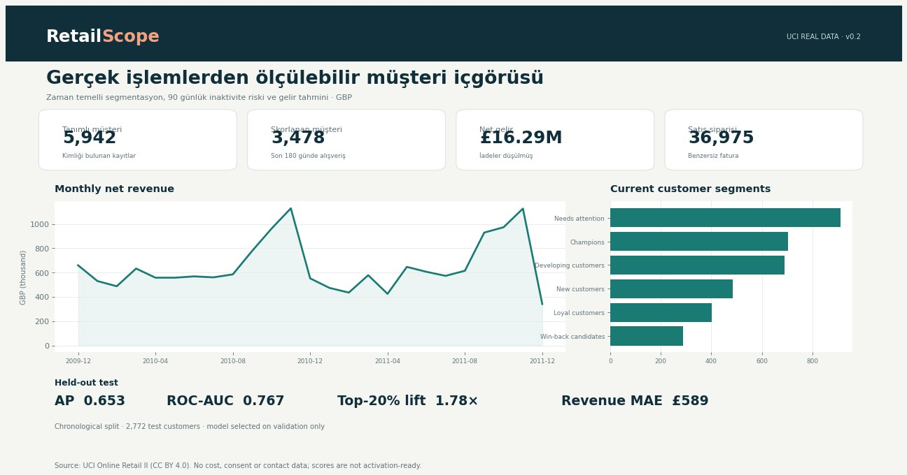

# RetailScope

RetailScope is an end-to-end CRM analytics case study for retail: data quality,
customer segmentation, 90-day inactivity risk, revenue forecasting, SQL Server
delivery, and Power BI-ready marts.

The primary track now runs on the real **UCI Online Retail II** transaction
dataset. A deterministic synthetic track remains available for identity
resolution, consent-aware campaign design, and gross-margin scenarios.



## What this project demonstrates

| Area | Implementation |
|---|---|
| Data engineering | Two-sheet Excel adapter, schema checks, deduplication, quarantine, row reconciliation |
| Customer analytics | RFM segments, recency/frequency/value features, product affinity, cohorts |
| Risk modeling | 90-day no-purchase probability with chronological validation and held-out testing |
| Value modeling | Next-90-day net-revenue regression with a mean baseline |
| Responsible CRM | Consent/contact absence blocks activation; no uplift or ROI claim |
| BI delivery | Star-schema CSV marts, SQL Server DDL/loaders, DAX measures, offline HTML dashboard |
| Quality assurance | Leakage, accounting, identity, segmentation, and targeting tests |

## Real-data result

Source: [UCI Online Retail II](https://archive.ics.uci.edu/dataset/502/online%2Bretail%2Bii),
CC BY 4.0, DOI `10.24432/C5CG6D`.

| Measure | Result |
|---|---:|
| Raw transaction rows | 1,067,371 |
| Accepted events | 797,885 |
| Identified customers | 5,942 |
| Customers scored at 2011-12-10 | 3,478 |
| Held-out test customers | 2,772 |
| Inactivity Average Precision | 0.6534 |
| Inactivity ROC-AUC | 0.7665 |
| Top-20% lift | 1.784× |
| 90-day revenue MAE | £588.67 |
| Mean-baseline revenue MAE | £845.93 |
| Automated tests | 17 passed |

Features stop at each cutoff; labels use the following 90 days. Training,
validation, and test outcome windows do not overlap. Model selection uses only
the validation period, and the September 2011 test period is reserved for final
reporting. Full evidence is in
[`docs/REAL_DATA_VALIDATION.md`](docs/REAL_DATA_VALIDATION.md).

## Quick start

Requirements: Python 3.12. GPU is not required.

```bash
python -m venv .venv
source .venv/bin/activate              # Windows: .venv\Scripts\activate
python -m pip install -r requirements.txt
python scripts/download_uci.py
python -m retailscope uci --input data/raw/online_retail_II.xlsx
python -m unittest discover -s tests -v
```

Open `outputs/real/reports/dashboard.html` for the interactive local report.
Generated source data and outputs are intentionally excluded from Git.

The synthetic reference pipeline is still reproducible:

```bash
python -m retailscope all
```

## Architecture

```text
UCI workbook
  -> schema validation, deduplication, quarantine
  -> leakage-safe customer snapshots and labels
  -> validation-based model selection
  -> held-out temporal evaluation
  -> customer scores, cohorts and product affinity
  -> HTML dashboard / CSV marts / SQL Server / Power BI
```

## SQL Server and Power BI

- [`sql/uci_schema.sql`](sql/uci_schema.sql) creates a non-destructive
  `retailscope_uci` star schema with keys, checks, indexes, and views.
- [`scripts/load_sqlserver_uci.py`](scripts/load_sqlserver_uci.py) validates CSV
  columns and loads five tables in one transaction. It refuses system databases
  and populated targets.
- [`powerbi/REAL_DATA_GUIDE.md`](powerbi/REAL_DATA_GUIDE.md) defines the model,
  relationships, pages, types, and refresh behavior.
- [`powerbi/real_measures.dax`](powerbi/real_measures.dax) provides GBP-aware
  measures for revenue, orders, returns, risk, and expected revenue.

GitHub Actions validates the DDL and transactional loader against a live SQL
Server 2022 container: all five tables, the monthly view, foreign keys, and
CHECK constraints are exercised with a relational smoke fixture. The full
797,885-event dataset was run through Python locally but is not loaded in CI.

Power BI Desktop is not available in the Linux build environment. The CSV
contracts, relationship guide, and DAX measures are delivered, but `.pbix`
visual validation must be completed on Windows. No unverified `.pbix` binary is
committed.

## Repository map

```text
retailscope/       Synthetic and real-data analytics pipelines
tests/             Leakage, accounting, identity, CRM and UCI adapter tests
sql/               SQL Server schemas and analysis queries
powerbi/           Model guides and DAX measures
templates/         Self-contained offline dashboards
scripts/           Data download, rendering and SQL Server loaders
docs/              Validation records, model cards and data documentation
```

## Interpretation limits

- “Inactivity” means no sale in the next 90 days, not contractual churn.
- UCI provides revenue but no cost; predicted revenue is not margin, LTV, or ROI.
- UCI provides no consent or contact data; every real-data score is marked
  `activation_eligible=false`.
- Predicted risk does not imply campaign uplift. Incremental impact requires a
  randomized experiment.
- The 2009–2011 UK retailer population may not generalize to present-day Turkey,
  baby retail, or ebebek.

The synthetic data contains no real customer or company records. This project
is independent and is not an ebebek production system.
