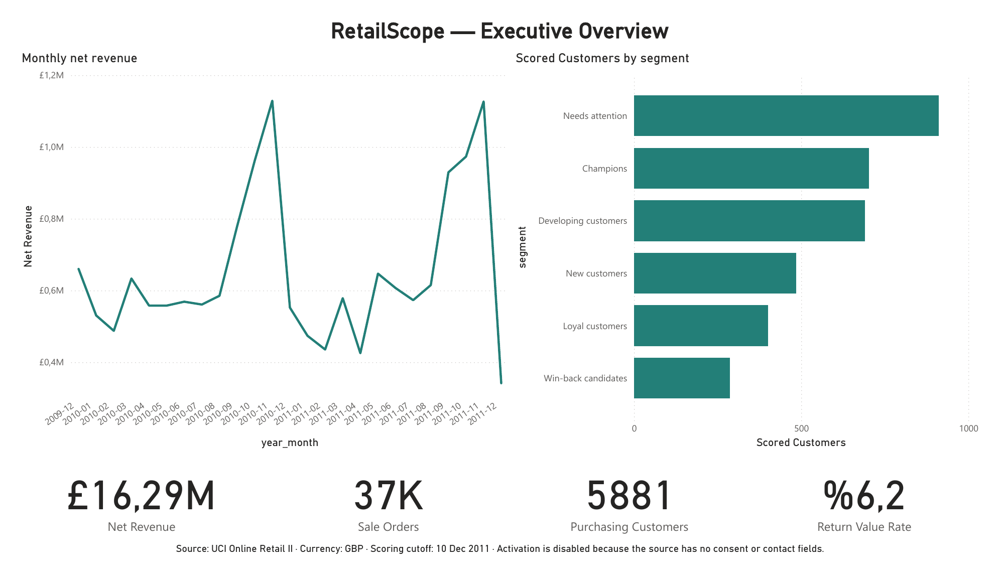
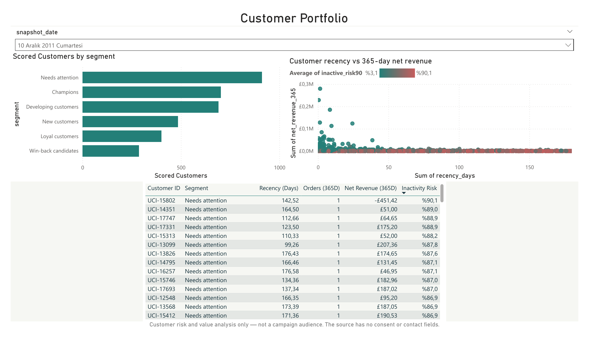
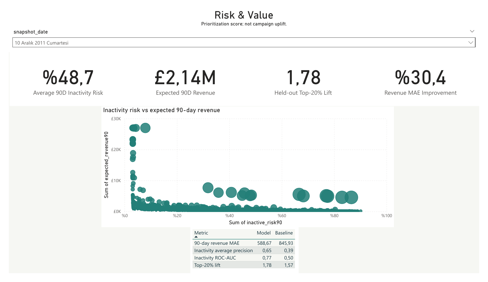
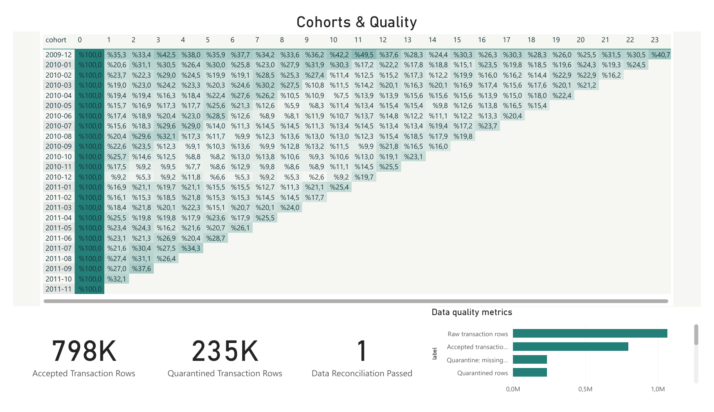
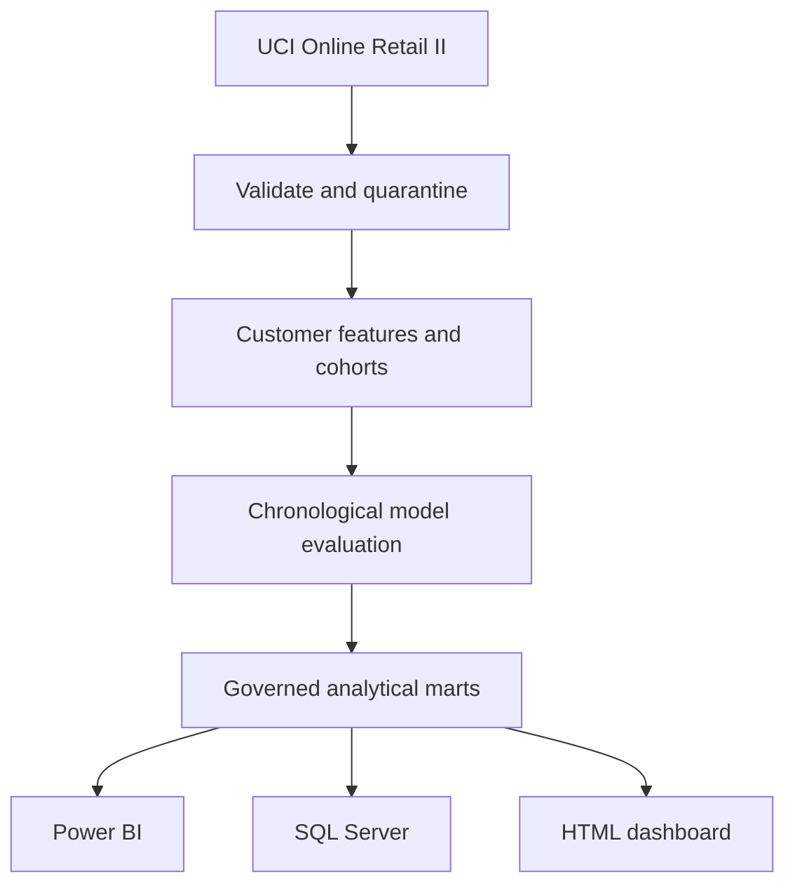

<h1 align="center">RetailScope</h1>

<p align="center">
  <strong>End-to-end retail CRM analytics with real transaction data, leakage-safe machine learning, SQL Server delivery, and an interactive Power BI report.</strong>
</p>

<p align="center">
  <a href="https://github.com/bekiroruk/retailscope-crm-analytics/actions/workflows/ci.yml"></a>
  
  
  
  
</p>



RetailScope turns the real [UCI Online Retail II](https://archive.ics.uci.edu/dataset/502/online%2Bretail%2Bii)
transaction dataset into a reproducible CRM decision-support product. It covers
data quality, customer segmentation, cohort retention, 90-day inactivity risk,
next-90-day revenue forecasting, governed analytical marts, and BI delivery.

The project was designed as a portfolio case study for retail and e-commerce
data science roles. It emphasizes not only model accuracy, but also identity,
accounting, temporal leakage, interpretability, reproducibility, and responsible
activation boundaries.

## What this project delivers

| Layer | Delivered outcome | Status |
|---|---|---|
| Data engineering | Validated ingestion, exact deduplication, quarantine, and row reconciliation | Complete |
| Customer analytics | RFM segmentation, cohorts, product affinity, and behavioral features | Complete |
| Machine learning | Chronological training, validation, held-out testing, and explicit baselines | Complete |
| Power BI | Four-page interactive PBIP report with 21 DAX measures and a reusable theme | Complete |
| SQL Server | Star schema, transactional loader, indexes, checks, and analytical view | Complete |
| Verification | 19 automated tests plus a live SQL Server 2022 CI smoke test | Passing |

## Power BI report

The version-controlled report is stored as a native Power BI Project:

- [`powerbi/RetailScope.pbip`](powerbi/RetailScope.pbip)
- [`powerbi/RetailScope.Report/`](powerbi/RetailScope.Report/)
- [`powerbi/RetailScope.SemanticModel/`](powerbi/RetailScope.SemanticModel/)

| Page | Decision supported |
|---|---|
| Executive Overview | Revenue trend, customer scale, returns, and segment mix |
| Customer Portfolio | Segment exploration and customer-level recency/value/risk review |
| Risk & Value | Joint prioritization using inactivity probability and expected revenue |
| Cohorts & Quality | Retention behavior, accepted/quarantined rows, and reconciliation health |

<table>
  <tr>
    <td width="50%"><br><strong>Customer Portfolio</strong></td>
    <td width="50%"><br><strong>Risk &amp; Value</strong></td>
  </tr>
</table>



The report uses a reusable `DataRoot` parameter and consumes published CSV
marts. Detailed setup notes are available in the
[Power BI guide](powerbi/README.md).

## Real-data results

Source: UCI Online Retail II, CC BY 4.0, DOI `10.24432/C5CG6D`.

### Data scale

| Metric | Result |
|---|---:|
| Raw transaction rows | 1,067,371 |
| Accepted events | 797,885 |
| Identified customers | 5,942 |
| Sale orders | 36,975 |
| Customers scored at 2011-12-10 | 3,478 |
| Held-out test customers | 2,772 |

### Held-out model performance

| Metric | Model | Baseline | Interpretation |
|---|---:|---:|---|
| Inactivity Average Precision | 0.6534 | 0.3929 | Better ranking under class imbalance |
| Inactivity ROC-AUC | 0.7665 | 0.5000 | Useful separation on future customers |
| Top-20% lift | 1.784x | 1.573x recency | Higher inactivity concentration than a simple ranking |
| 90-day revenue MAE | £588.67 | £845.93 | 30.4% lower error than the mean baseline |

Features stop at each cutoff and labels use the following 90 days. Training,
validation, and test outcome windows do not overlap. Model selection uses only
the validation period; the September 2011 test cutoff is reserved for final
reporting. See the [validation record](docs/REAL_DATA_VALIDATION.md) and
[model card](docs/REAL_DATA_MODEL_CARD.md).

## Architecture



The Python pipeline owns the analytical logic. Power BI and SQL Server consume
published marts instead of independently recreating feature or model code.

## Reproduce the analysis

Requirements: Python 3.12; no GPU required.

### Windows PowerShell

```powershell
py -3.12 -m venv .venv
.\.venv\Scripts\Activate.ps1
python -m pip install -r requirements.txt
.\scripts\prepare_powerbi.ps1
```

The preparation script downloads and verifies the official workbook, runs the
real-data pipeline, executes all tests, validates the Power BI package, and
publishes the marts used by the report.

### Cross-platform pipeline

```bash
python -m venv .venv
source .venv/bin/activate
python -m pip install -r requirements.txt
python scripts/download_uci.py
python -m retailscope uci --input data/raw/online_retail_II.xlsx
python -m unittest discover -s tests -v
python scripts/validate_powerbi_contract.py --data-root outputs/real/marts
```

Open `outputs/real/reports/dashboard.html` for the offline HTML report. Source
data and generated outputs are excluded from Git; the download script verifies
the official workbook SHA-256 before processing.

Run the deterministic synthetic reference path with:

```bash
python -m retailscope all
```

## Delivery layers

### SQL Server

[`sql/uci_schema.sql`](sql/uci_schema.sql) creates the non-destructive
`retailscope_uci` star schema with keys, checks, indexes, and an analysis view.
[`scripts/load_sqlserver_uci.py`](scripts/load_sqlserver_uci.py) validates CSV
contracts and loads all target tables in one transaction. It refuses system
databases and populated targets.

GitHub Actions runs the schema and loader against a live SQL Server 2022
container, then verifies tables, the monthly view, foreign keys, and CHECK
constraints. CI uses a compact relational smoke fixture; the full real dataset
is processed locally.

### Power BI

The [Power BI delivery kit](powerbi/README.md) includes:

- eight typed analytical tables;
- a machine-readable model contract and reusable Power Query parameter;
- relationships and 21 DAX measures;
- a custom report theme;
- four decision-focused report pages;
- automated validation for marts, relationships, measures, theme, and bindings;
- version-controlled PBIR and TMDL source files.

## Repository guide

| Path | Contents |
|---|---|
| [`retailscope/`](retailscope/) | Synthetic and UCI analytics pipelines |
| [`tests/`](tests/) | Leakage, accounting, identity, CRM, UCI, and BI-contract tests |
| [`sql/`](sql/) | SQL Server schemas and analytical queries |
| [`powerbi/`](powerbi/) | PBIP report, semantic model, DAX, Power Query, theme, and documentation |
| [`templates/`](templates/) | Self-contained offline dashboard templates |
| [`scripts/`](scripts/) | Download, rendering, validation, and SQL Server utilities |
| [`docs/`](docs/) | Data dictionary, model cards, sources, validation evidence, and report images |

## Interpretation boundaries

- "Inactivity" means no sale in the next 90 days, not contractual churn.
- UCI provides revenue but no cost; predicted revenue is not margin, LTV, or ROI.
- UCI provides no consent or contact data; every real-data score is marked
  `activation_eligible=false`.
- Predicted risk does not imply campaign uplift. Incremental impact requires a
  randomized experiment.
- The 2009-2011 UK retailer population may not generalize to present-day Turkey,
  baby retail, or ebebek.

The synthetic data contains no real customer or company records. RetailScope is
an independent portfolio project and is not an ebebek production system.
