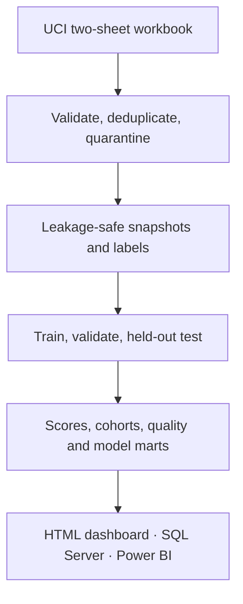

# RetailScope

**An end-to-end CRM analytics case study for retail—built around customer data
quality, RFM segmentation, 90-day inactivity risk, revenue forecasting, and
decision-ready BI delivery.**

The primary track uses the real [UCI Online Retail II](https://archive.ics.uci.edu/dataset/502/online%2Bretail%2Bii)
transaction dataset. A deterministic synthetic track remains available for
identity resolution, consent-aware targeting, and gross-margin scenarios that
the public source cannot support.


## Project snapshot

| Layer | Delivered outcome | Status |
|---|---|---|
| Data quality | Schema checks, exact deduplication, quarantine, row reconciliation | Complete |
| Customer analytics | RFM segments, cohorts, product affinity, risk/value features | Complete |
| Modeling | Chronological train/validation/test design with explicit baselines | Complete |
| Delivery | HTML dashboard, CSV marts, SQL Server schema/loader, Power BI authoring kit | Complete |
| Verification | Unit tests plus live SQL Server 2022 integration smoke test in CI | Passing |
| Power BI binary | Final refresh, render review, and `.pbix` save in Desktop on Windows | Desktop step |

## Why this case study exists

A useful CRM model is more than an algorithm. Customer identities must be
trustworthy, transaction totals must reconcile, features must stop at the
prediction cutoff, scores must be interpretable by business teams, and any
activation list must respect consent and contactability.

RetailScope treats those concerns as one product:

- unifies and validates customer and transaction data;
- describes customer behavior through RFM, cohorts, and product affinity;
- estimates 90-day inactivity risk and next-90-day net revenue;
- compares every model with a simple baseline on a future holdout period;
- exports governed marts for SQL Server and Power BI;
- blocks activation when consent and contact evidence are unavailable.

## Real-data results

Source: UCI Online Retail II, CC BY 4.0, DOI `10.24432/C5CG6D`.

### Data scale

| Metric | Result |
|---|---:|
| Raw transaction rows | 1,067,371 |
| Accepted events | 797,885 |
| Identified customers | 5,942 |
| Sale orders | 36,975 |
| Customers scored at 2011-12-10 | 3,478 |
| Held-out test customers | 2,772 |

### Held-out model performance

| Metric | Model | Baseline | Interpretation |
|---|---:|---:|---|
| Inactivity Average Precision | 0.6534 | 0.3929 | Better ranking under class imbalance |
| Inactivity ROC-AUC | 0.7665 | 0.5000 | Useful separation on future customers |
| Top-20% lift | 1.784× | 1.573× recency | Higher inactivity concentration than a simple ranking |
| 90-day revenue MAE | £588.67 | £845.93 | 30.4% lower error than the mean baseline |

Features stop at each cutoff and labels use the following 90 days. Training,
validation, and test outcome windows do not overlap. Model selection uses only
the validation period; the September 2011 test cutoff is reserved for final
reporting. See the full [validation record](docs/REAL_DATA_VALIDATION.md) and
[model card](docs/REAL_DATA_MODEL_CARD.md).

## Architecture



The Python pipeline owns analytical logic. SQL Server and Power BI consume
published marts rather than independently recreating feature or model code.

## Reproduce the analysis

Requirements: Python 3.12; no GPU required.

```bash
python -m venv .venv
source .venv/bin/activate              # Windows: .venv\Scripts\activate
python -m pip install -r requirements.txt
python scripts/download_uci.py
python -m retailscope uci --input data/raw/online_retail_II.xlsx
python -m unittest discover -s tests -v
python scripts/validate_powerbi_contract.py --data-root outputs/real/marts
```

Then open `outputs/real/reports/dashboard.html`. Source data and generated
outputs are intentionally excluded from Git; the download script verifies the
official workbook SHA-256 before the pipeline runs.

Run the deterministic synthetic reference path with:

```bash
python -m retailscope all
```

## Delivery layers

### SQL Server

[`sql/uci_schema.sql`](sql/uci_schema.sql) creates the non-destructive
`retailscope_uci` star schema with keys, checks, indexes, and an analysis view.
[`scripts/load_sqlserver_uci.py`](scripts/load_sqlserver_uci.py) validates CSV
contracts and loads all target tables in one transaction. It refuses system
databases and populated targets.

GitHub Actions runs the schema and loader against a live SQL Server 2022
container, then verifies tables, the monthly view, foreign keys, and CHECK
constraints. The full real dataset is processed locally; CI uses a compact
relational smoke fixture.

### Power BI

The [Power BI delivery kit](powerbi/README.md) includes:

- eight-table machine-readable model contract;
- typed Power Query expressions with a reusable data-root parameter;
- relationships and 21 DAX measures;
- a report theme and four-page visual specification;
- automated validation for CSV headers, relationships, DAX names, theme JSON,
  and visual bindings;
- a Windows preparation script for the final Desktop build.

Microsoft requires Power BI Desktop for PBIX/PBIP conversion. Because the build
environment is Linux, the repository does not commit an unopened or unverified
`.pbix`; only the final Desktop refresh and binary save remain platform-bound.

## Repository guide

| Path | Contents |
|---|---|
| [`retailscope/`](retailscope/) | Synthetic and UCI analytics pipelines |
| [`tests/`](tests/) | Leakage, accounting, identity, CRM, UCI, and BI-contract tests |
| [`sql/`](sql/) | SQL Server schemas and analytical queries |
| [`powerbi/`](powerbi/) | Model contract, Power Query, DAX, theme, and report specification |
| [`templates/`](templates/) | Self-contained offline dashboards |
| [`scripts/`](scripts/) | Download, rendering, validation, and SQL Server utilities |
| [`docs/`](docs/) | Data dictionary, model cards, sources, and validation evidence |

## Interpretation boundaries

- “Inactivity” means no sale in the next 90 days, not contractual churn.
- UCI provides revenue but no cost; predicted revenue is not margin, LTV, or ROI.
- UCI provides no consent or contact data; every real-data score is marked
  `activation_eligible=false`.
- Predicted risk does not imply campaign uplift. Incremental impact requires a
  randomized experiment.
- The 2009–2011 UK retailer population may not generalize to present-day Turkey,
  baby retail, or ebebek.

The synthetic data contains no real customer or company records. RetailScope is
an independent portfolio project and is not an ebebek production system.
